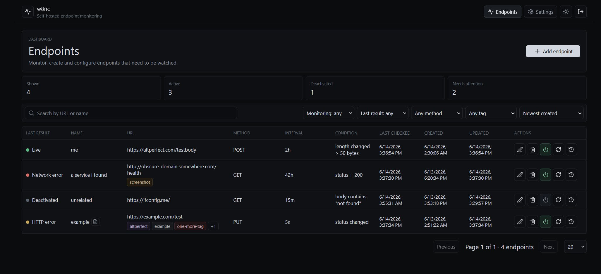

# w8nc

Self-hosted endpoint monitoring for monitoring workflows. The app stores HTTP endpoints, pings active targets on their configured interval, records status/length/error metadata, evaluates notify-once conditions, and dispatches Telegram alerts through the ProjectDiscovery `notify` binary.



## Quick Start

```sh
make init-secrets
make deploy
```

Open `http://127.0.0.1:8080` and sign in with the generated password.

On the first run, the app creates a random login password and prints it to the app container logs:

```sh
docker compose logs app
```

Look for the `login password generated` log line, then change the password in Settings.

If that first generated password is no longer in the retained logs, generate and set a new one from the project directory:

```sh
make set-password
```

The command prints the new password, invalidates existing sessions, and clears current login lockouts.

`make init-secrets` creates a local `.env` file with `SESSION_SECRET` and `ENCRYPTION_KEY`. Keep that file private and backed up. It is ignored by git.

If you already have encrypted values saved and are upgrading from an older compose file that contained a hardcoded key, create `.env` with the current key first, deploy, then rotate it:

```sh
ENCRYPTION_KEY='current-base64-key' make init-secrets
make deploy
make rotate-encryption-key
```

Changing `ENCRYPTION_KEY` without rotation makes existing encrypted Telegram tokens, SOCKS5 passwords, and masked headers unreadable.

The compose file binds the app to `127.0.0.1:8080` by default. If you set `AUTH_ENABLED=false`, keep that localhost binding or put the app behind another trusted access control layer.

## Configuration

The server is configured with environment variables:

| Variable | Default in compose | Purpose |
| --- | --- | --- |
| `APP_ADDR` | `0.0.0.0:8080` | Go HTTP listen address inside the container |
| `DATABASE_URL` | Postgres service URL | PostgreSQL connection string |
| `AUTH_ENABLED` | `true` | Enables password login and session cookies |
| `SESSION_SECRET` | required through `.env` or shell | Secret used when hashing session tokens |
| `COOKIE_SECURE` | `false` | Set `true` when serving over HTTPS |
| `ENCRYPTION_KEY` | required through `.env` or shell | Base64 32-byte key for sensitive headers, SOCKS5 passwords, and Telegram tokens |
| `NOTIFY_BIN_PATH` | `/usr/local/bin/notify` | Path to ProjectDiscovery `notify` |
| `NOTIFY_PROVIDER_CONFIG_PATH` | `/app/data/notify-provider.yaml` | Generated provider config path |
| `DEFAULT_REQUEST_TIMEOUT` | `10s` | Per-ping HTTP timeout |
| `DEFAULT_MAX_RESPONSE_BYTES` | `5242880` | Max decompressed response bytes to read |
| `SCHEDULER_TICK_INTERVAL` | `1s` | Database scheduler loop interval |
| `PING_WORKER_CONCURRENCY` | `10` | Bounded ping worker count |
| `MIN_PING_INTERVAL` | `5s` | Minimum accepted endpoint interval |
| `MAX_PING_INTERVAL` | `30d` | Maximum accepted endpoint interval |
| `SCREENSHOTS_ENABLED` | `true` | Enables screenshot attempts for matched GET endpoint conditions |
| `SCREENSHOT_CHROME_PATH` | `/usr/bin/chromium-browser` | Chromium executable used for screenshots |
| `SCREENSHOT_STORAGE_PATH` | `/app/data/screenshots` | PNG storage directory for captured screenshots |
| `SCREENSHOT_TIMEOUT` | `20s` | Per-screenshot browser timeout |
| `SCREENSHOT_VIEWPORT_WIDTH` | `1365` | Screenshot browser viewport width |
| `SCREENSHOT_VIEWPORT_HEIGHT` | `900` | Screenshot browser viewport height |
| `SCREENSHOT_MAX_CONCURRENCY` | `1` | Max screenshot attempts processed per worker tick |
| `ALLOW_PRIVATE_TARGETS` | `false` | Allows localhost/private/metadata targets when true |
| `LOG_LEVEL` | `info` | `debug`, `info`, `warn`, or `error` |

## Telegram Notifications

Create a Telegram bot with BotFather, get the bot token, and determine the chat ID for the target chat. In the app, open Settings and enter:

- Telegram enabled
- Bot API token
- Chat ID
- Parse mode: `None`, `Markdown`, `MarkdownV2`, or `HTML`

## Notify Conditions

V1 supports the following conditions for notifications:

- `body_contains`: case-sensitive plain text body match
- `status_code_equals`: fires when the current status equals the configured code
- `status_code_changed`: first HTTP response establishes a baseline, later changes fire
- `response_length_changed`: first non-truncated response establishes a baseline, later length differences greater than tolerance fire

When a condition matches, the app creates one `notification_events` row, deactivates the endpoint, sets `notified_at`, and sets `deactivated_reason=notify_once_condition_matched`.

## Screenshots

Endpoint create/edit supports an optional screenshot-on-match setting. Screenshotting is supported only for `GET` endpoints.

Successful screenshots are sent to Telegram along with the initial notification. Screenshot attempts are also shown in check history. Failed attempts can be retried from the check history modal once the previous attempt is finished.

## SOCKS5 Proxies

Endpoint create/edit supports an optional SOCKS5 proxy. When enabled, scheduled pings, manual pings, and test requests for that endpoint are sent through the proxy. Use `host:port` or `socks5://host:port`. Username/password authentication is optional; saved proxy passwords are encrypted and returned as `********`.

Settings also supports a SOCKS5 proxy for Telegram notifications. When enabled, the app passes the proxy to ProjectDiscovery `notify` with its native `-proxy` flag.

## Development

Common workflows are available through the root Makefile, just run `make help` to see all the options.

## Reverse Proxy

For detailed instructions on how to run the app behind a reverse proxy, read [Hosting behind a reverse-proxy.md](<Hosting behind a reverse-proxy.md>).
